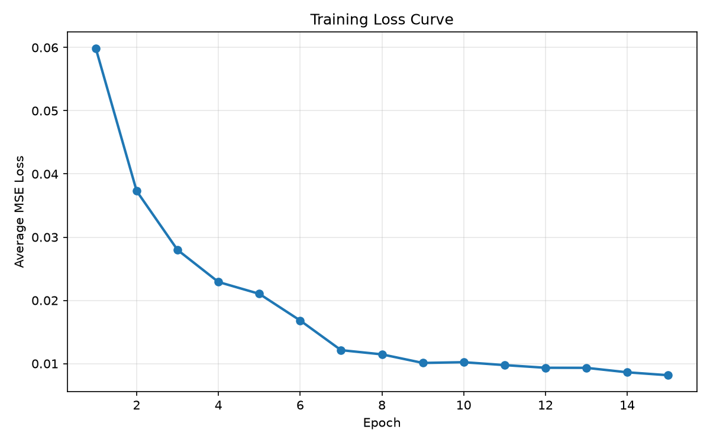
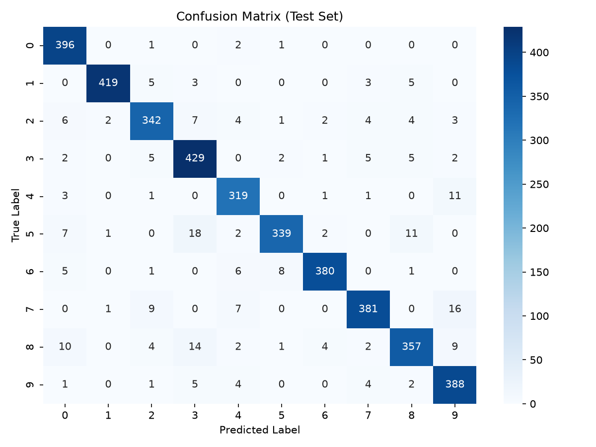

# Neural Network from Scratch

A simple feedforward neural network implemented from scratch in NumPy (no deep learning frameworks), trained on the MNIST handwritten digits dataset.

## Features

- Fully connected layers with Xavier/Glorot weight initialization
- Sigmoid activation
- Manual forward and backward propagation (gradient descent)
- Mean Squared Error loss
- Trained and evaluated on MNIST (784 → 64 → 10)

## Project Structure

```
neural_network/
├── src/
│   ├── neuron.py     # single neuron + sigmoid activation
│   ├── layer.py       # fully connected layer (forward/backward)
│   ├── network.py    # stacks layers into a network
│   ├── loss.py        # MSE loss, one-hot encoding, derivatives
│   └── train.py        # loads MNIST, trains the network, saves plots
├── assets/               # generated plots
└── requirements.txt
```

## Setup

```bash
python -m venv venv
source venv/bin/activate
pip install -r requirements.txt
```

## Usage

```bash
cd src
python train.py
```

This downloads MNIST (first run only), trains the network for 15 epochs, prints the test accuracy, and saves the plots below to `assets/`.

## Results

**Training loss curve**



**Confusion matrix on the test set**


